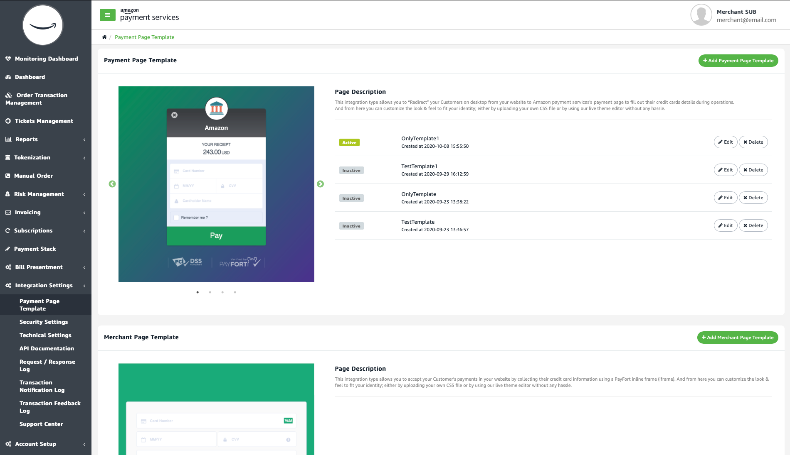

Standard merchant page integration
==================================

Your customers can effortlessly check out and pay right on your website
when you integrate the Amazon Payment Services inline frame (iframe)
into your checkout page. We call it the standard merchant page
integration route.

Our iframe-based payment integration route is easy to implement. It
means that, with little coding effort, you can offer your customers the
ability to check out and pay on the website that they know and trust.

When you use the standard integration route you remove the need to
redirect your customer to the Amazon Payment Services website when they
pay. Instead, your customer completes the entire checkout process,
including payment, on your website.

This unified experience reduces the risk that your customer abandons
their shopping cart. You also retain more control over the transaction
flow.

When should you use standard merchant page integration?
-------------------------------------------------------

The standard merchant page integration route is a good option for
ordinary ecommerce websites that follow a standard checkout process.
Consider the common scenario where checkout and payment occur
simultaneously, and where payments are once-off.

In other words, you can adopt the standard merchant page integration
route where there are no unusual use-case or technical requirements.

Note that you can customize the iframe-based form used for standard
merchant page integration to fit the look and feel of your site.
However, for maximum customization or unique technical challenges, you
may want to consider the [custom merchant page integration
route](22b.md).

Standard merchant page integration is mobile-friendly, but if you have
an Android or iOS app we recommend that you consider our [mobile SDK
instead](23b.md) or that you [custom-code your in-app payment
experience](23e.md) by directly connecting with our APIs via the
custom merchant page integration route.

Don't forget: we have dedicated integration guides [for all the popular
ecommerce suits](22d.md) including Magento, PrestaShop and
WooCommerce. If you are using one of these popular products you should
read the relevant guide instead.

How does it work in practice?
-----------------------------

Standard merchant page integration makes use of an HTML iframe that
contains the payment form fields. To integrate Amazon Payment Services
into your checkout page you simply need to insert the iframe into the
appropriate area on your checkout page.

It is straightforward to include an iframe on your checkout page. You
develop your site just like you normally would, using the web technology
of your choice. There is no need to change the look and feel of your
merchant site: you can customize the iframe to match your site.

Simply include a reference to the Amazon Payment Services iframe in the
position on your checkout page where you want to accept payment cards.

In practice, standard merchant page integration using an iframe works
like this:

1.  Your checkout page displays an integrated Amazon Payment Services
    iframe that looks just like the rest of your website. Your customer
    sees the iframe as just one section of a single, continuous page.

2.  The customer completes their payment details on the payment page, on
    your site.

3.  Your webpage sends the payment card details directly to Amazon
    Payment Services without handling or storing the payment card data.

4.  The Amazon Payment Services server receives the card details and
    attempts to authorize the payment.

5.  Amazon Payment Services sends a confirmation to your checkout page
    so that you can complete the transaction.

The above process illustrates how your customer experiences a smooth,
flawless checkout process contained in a single website -- even though
your web server never handles, manipulates or stores payment card data.

Note that you must correctly and adequately handle transaction feedback
when you implement standard merchant page integration. Every payment
transaction that you process will trigger a response -- and your website
must be able to interpret and respond to the transaction feedback. [Read
more about transaction feedback here](38.md).

Payment workflow
----------------

Standard merchant page integration gives your customer a seamless
experience. But what happens in the background? This is the workflow
when you use standard merchant page integration:

1.  Your customer begins the checkout process on your website.

2.  The payment page, with integrated iframe, is displayed on your site.

3.  Your customer enters their card details into form fields contained
    in the iframe, on the payment page, on your site.

4.  Your webpage captures the payment card details and directly passes
    the payment card details to Amazon Payment Services -- your server
    never receives, handles or stores payment card details.

5.  Amazon Payment Services verifies that the card details are correct.

6.  Next, Amazon Payment Services creates a unique token for the
    transaction and sends the token to your payment page.

7.  Your payment page receives the token and creates a record on your
    server with the token name to facilitate the transaction flow.

8.  Your payment page sends a JSON request along with the token to
    Amazon Payment Services.

9.  If your customer's bank uses 3D Secure, and if a check is required,
    your page will receive a 3D Secure URL (3DS URL) from the Amazon
    Payment Services server and a response indicating that 3D Secure
    verification will take place:

    i.  The payment page redirects the customer to the 3D Secure Access
        Control Server (ACS) to verify card enrollment.

    ii. Your customer enters their authentication data on the ACS page.

    iii. The ACS attempts to authenticate the customer's data and sends
         the authentication results to Amazon Payment Services.

10. Amazon Payment Services completes the operation based on the 3D
    Secure response.

11. The result of the payment authentication attempt is sent to your
    server.

12. Your server confirms or pauses the transaction accordingly.

👆 If you included a token in the request sent to us (by using the
token_name parameter), and if the token you provided has already been
associated with an successful authorization, Amazon Payment Services
will render an iframe that displays the customer's masked payment card
number and expiry date instead of rendering blank card number and expiry
date fields.

👆 When we refer to any of: *payment processing page*, *payment form*, or
*payment details form* we are always referring to the payment page on
your site. In other words, the area on your website where your customer
entered payment details.

Safe (Tokenization) and standard merchant page integration
---------------------------------------------------

Tokens are critical to the functioning of standard merchant page
integration. When your customer enters their payment card details we
issue a unique token name associated with your customer's payment card
details. By referring to this unique token your server can complete the
transaction without capturing or storing your customer's sensitive card
data.

You can also use tokenization to make life easier for your customer
after the first transaction. If you implement tokens correctly your
customer will not need to enter their full payment card details every
time that they shop with you. Instead, your customer only completes the
card security code when checking out.

Note that your customer must opt in to the retention of their payment
card data, if they do not do so they would need to enter their full
payment card data every time they shopped.

[Read more about tokenization here](31.md), including a full
explanation on how to incorporate tokenization in your payment
processing and how you can enable your customer to update saved payment
card data.

If you implement tokenization fully the payment process for future
transactions will look like this:

1.  Amazon Payment Services processes the first payment successfully by
    authorizing a transaction based on the full card details as entered
    by the customer.

2.  You, the merchant, receive a unique token, token_name, in the
    payment response. This unique ID, token_name, is the permanent token
    name. You can use token_name whenever your customer pays in the
    future. Simply submit token_name in the next transaction alongside
    the card_security_code parameter.

3.  The next time your customer checks out there is no need to display
    the full payment page. You only need to capture the card security
    code from your customer.

If your customer needs to update or delete their payment card you can
facilitate their request. View the Update Token section of this guide.

Understanding the difference between standard and custom merchant page integration
----------------------------------------------------------------------------------

We offer you two in-page payment integration routes -- the standard
route that utilizes a pre-built iframe, or a custom route [where you
code your own form to capture payment data](22b.md).

Both options avoid redirection: your customer checks out and pays on
your site. Similarly, both integration routes imply that your server
never receives, handles, or stores confidential payment card data.

The standard merchant page integration route renders a pre-built iframe
that is contained in your checkout page. It is a great way to get
payment processing integrated into your website with relatively little
development time -- while still offering your customers a checkout
experience that matches the look and feel of your site.

For most merchants the standard merchant page integration route offers
sufficient customization options. It is easy to adapt the standard
merchant page integration iframe to match the look and feel of your
website.

In contrast, custom merchant page integration means that you must custom
code your own payment processing form using the tools available in our
API. That said, the custom integration route gives you more control over
the look and feel and functionality of the payment form.

If your site has unique customization needs or technical characteristics
you may want to choose the custom merchant page integration route to
build a payment form that meets your exact requirements.

Whichever route you choose, standard or custom, the Amazon Payment
Services server always handles payment card data. Our merchant page
integration routes do not require your server to receive, process or
store payment card numbers or other sensitive data.

 example "Choose standard merchant page integration when:"
    
    1.	You need a fast way to deliver a customized, seamless checkout experience
    2.  You want to use an Amazon Payment Services payment form that is encapsulated in an iframe
    3. 	You have standard payment processing requirements
    4.	You have limited access to developer resources

 example "Choose custom merchant page integration when:"
    
    1.	You have access to a deep pool of development resources
    2.	You want to create your own payment form
    3.	Your technical requirements are unique
    4.	You require a very high degree of customization
    5.	Your business logic or use case is unique
  

Understanding the difference between merchant page integration and redirection
------------------------------------------------------------------------------

When you use standard merchant page integration you design a checkout
page that is hosted on your website. Next, when you render your checkout
page, you include the Amazon Payment Services iframe on that page. The
iframe is displayed inside a page on your site and your customer enters
payment card details on that page.

To process a payment, you use a form action to send the details your
customer entered on your checkout page to Amazon Payment Services. The
details are authenticated by the Amazon Payment Services server. Based
on the token response, you can complete the checkout process for your
customer.

### Redirection

With redirection you authorize a customer's payment by redirecting the
customer to an Amazon Payment Services gateway page for payment.

To process a payment your website displays a checkout page where your
customer agrees to a total amount to pay. When your customer clicks the
pay button your customer is sent to a payment page on the Amazon Payment
Services server where your customer's card details are captured and
authorized. On completion the customer is redirected to the merchant
site.

We offer [more details on how to process payments using redirection
here](22c.md).

Integrating an iframe into your payment page
--------------------------------------------

If you decide to use standard merchant page integration using an iframe
you need to select whether you want to use the testing endpoint while
you verify functionality, or whether you want to use the live endpoint
to process customer payments. [Read more about testing
here](12.md).

Either way, our iframe integration gives you a lot of flexibility. You
can code your site in the programming language of your choice, all you
need to do is to include the Amazon Payment Services iframe on an
HTML-based checkout page.

### Customizing your iframe payment form

You can customize the merchant page integration iframe so that it looks
just like the rest of your website. By styling the Amazon Payment
Service iframe you can mirror the look and feel of your website, giving
your customers a seamless experience.

Styling the iframe requires the use of CSS files. You need to set CSS
classes inside a .css file to achieve your styling goals. If you are new
to HTML and CSS you can visit [this
link](https://www.w3schools.com/css/default.asp) to learn more about
HTML and CSS.

Amazon Payment Services offers a set list of CSS classes that you can
use to style the basic payment page. This list will give you an idea of
what you can customize, but refer to our full API reference for complete
details:

-   Define the total width of the form container and the background
    style with the Wrapper class

-   Define the form shape and width with the Container class

-   Define error messages with the Popover class

-   Merge the date and the CVV fields into one block if you need to
    using the Half-container class

-   The container of each single input field is in the Input class

-   Define your submit button with the Pay class

-   Change the color of the Visa / Mastercard image with the Visa /
    Mastercard classes.

The Amazon Payment Services back office includes a template section that
makes it easy to upload customized iframe code:

Figure 3 Use the Payment Settings page to upload an iframe for your
payment form

👆 You can create multiple theme files so that you can switch freely and
easily between themes when necessary. Theme files offer you the
flexibility to change the look and feel of your page.

👆 Theme files can be uploaded in the back office using the Payment Page
Template screen.

### Form submission and response

The form contained in your iframe will submit a request in a form post.
This request will contain the required parameters -- visit this page in
our API reference for a list of parameters.

Go to the full API reference
----------------------------

This page is intended to help you understand how the standard merchant
page integration route works. Developers should [review the full API reference](https://paymentservices-reference.payfort.com//docs/api/build/index.html#standard-merchant-page-integration){target=_self}
for complete instructions on how to implement standard merchant page
integration including a full list of parameters and the relevant
endpoints.

Need further help?
------------------

If you get stuck feel free to get in touch with the Amazon Payment
Services team. Just message our support team at <merchantsupport-ps@amazon.com>.
