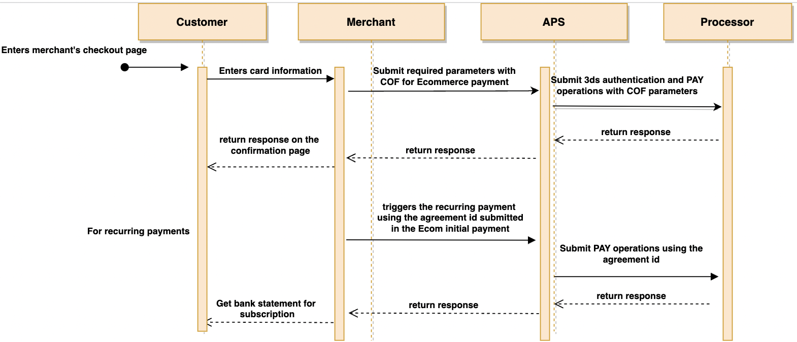

Processing recurring payments
=============================

If your business needs to accept regular, recurring payments from
its customers it can easily do so using our API. For example, you can
set in place a regular subscription payment for a streaming service, or
a payment that facilitates bill payments.

You can effortlessly configure secure, recurring payments for any defined
billing cycle -- whether daily, weekly, monthly, or annual. You do so through
a workflow that is not much different from the normal checkout process.

When you use our recurring payments API you ensure that your customer does
not need to interact with your website every time that a recurring payment
is due. Instead, Amazon Payment Services simply processes the next recurring
charge using the saved card details.

How do recurring payments work?
-------------------------------

When you set up recurring payments you do so by coding a payment workflow
that utilizes standard Amazon Payment Services APIs to process recurring 
transactions.

After the first transaction your customer makes a specific token name is
associated with your customer's payment card details. You can then charge
your customer's payment card by referring to the established token.

You process recurring billing by using the `purchase` operation configured
in single message mode. In practice the process works like this:

1.  You initiate the first customer’s transaction with
    the required payments detailsto generate the card’stoken.

2. You assign the token to a specific customer account on your server.
    For more details on tokenization please [refer to the tokenization page](31.md).

3.	Your backend system sends the recurring transaction details along with
    the customer's card token to Amazon Payment Services.

4.	The transaction is processed, and a response is returned to your site
    indicating the status of the transaction.

👆 Note that you must code the recurring payment workflow on your server.
Amazon Payment Services will not automatically charge a recurring
payment. You must ensure that your server requests the recurring payment
when it is due by developing a recurring payment process in your website
code.

Integrating recurring payments
------------------------------

You can integrate recurring payments into your website in just the same
way you integrate ordinary payments. You do so by using the [custom
merchant page integration route](22b.md).

However, the transaction details that you send to Amazon Payment
Services is different. For example, the `eci` parameter in your `purchase`
command will contain the phrase "RECURRING" to indicate that you are
processing a recurring transaction.

Note that you will rely on tokens to enable recurring payments. [Read
our page on tokenization](31.md) for more insight into how
tokens enable recurring payments.

Card on File Transactions
-------------------------

Amazon Payment Services enables you to collect additional payment details
related to your customer’s subscription and store them through APS to process
subsequent payments as following:

•	Provide the required subscription information in the initial transaction. 
    APS will store the submitted details for customer’s recurring payments.

•	Use the stored payment details to perform subsequent payments, 
    initiated by you, as a result of a payment agreement with your customer.

How do I know which subscription model to use?
----------------------------------------------

You can charge the customer based on the product subscription model, without
the customer having to enter their payment details for every transaction. The
subscription model can be scheduled or unscheduled. Scheduled transactions can
further be classified as fixed or variable. You can define the recurring mode as:

•	`FIXED` : The payment amounts in the subscription have the same amount.
    For example, for magazine subscriptions or gym memberships, your customer
    pays a fixed amount over a specific subscription period. In this example,
    both the amount and the subscription period do not change over time.

•	`VARIABLE` : The payment amounts in the subscription differs every time.
    For example, for electricity or phone bills, you pay different amounts
    over a defined period of time. In this example, the amount may change but
    the subscription period remains the same.

•	`UNSCHEDULED` : A subscription mode where you deduct amounts for recurring
    payment whenever required. This mode does not require a fixed time range or
    a fixed amount for payments. For example, auto top-ups when the account value
    falls below a threshold. In this mode, the subscription time period and the amount
    both vary depending on the conditions you've set.

👆 Before initiating recurring transactions, make sure there’s an
initial ecommerce payment transaction where the card is authenticated successfully.
An agreement id should be submitted in the initial payment to map it with the
subsequent recurring payments. In the subsequent payments after the first transaction,
set the `eci` parameter in your request to `RECURRING` to indicate that you are processing
a recurring transaction.

Integrating Recurring with Card on File details.
------------------------------------------------

1.	The customer enters card information on the merchant’s checkout page.
2.	The merchant submits required card on file (COF) parameters which are:
     agreement_id and recurring_mode to  Amazon Payment Services.
3.	Amazon Payment Services submits payment request and return back transaction
     response along with the token name. 
4.	For recurring payments, the merchant initiates a transaction with the agreement_id
    of the initial payment, token name received in step.3 and other required parameters
    to Amazon Payments Services then processes that transaction.

You can integrate recurring payments into your website in just the same way you
integrate ordinary payments However, the transaction details that you send to
Amazon Payment Services are different. You have to set the following additional parameters:

1.	Set the `agreement_id` in the initial ecommerce payment along with the other
     payment details.
2.	Define the subscription model using the `recurring_mode`. Possible values are
     `UNSCHEDULED`, `VARIABLE`, or `FIXED`.
3.	Define the number of subsequent payments to be deducted using recurring_transactions_count.
     This parameter is required when the subscription model is `VARIABLE` or `FIXED`.
4.	For recurring transactions, set the eci parameter in your purchase command to `RECURRING`
     and set the same `agreement_id` submitted in the ecommerce payment.

Go to the full API reference
----------------------------

This page is intended to help you understand how recurring payments
work. [Developers should review the full API
reference](https://paymentservices-reference.payfort.com//docs/api/build/index.html#recurring-transactions){target=_self}
for complete instructions on how to implement recurring payments
including a full list of parameters and the relevant endpoints.

Need further help?
------------------

If you get stuck feel free to get in touch with the Amazon Payment
Services team. Just message our support team at <merchantsupport-ps@amazon.com>.
