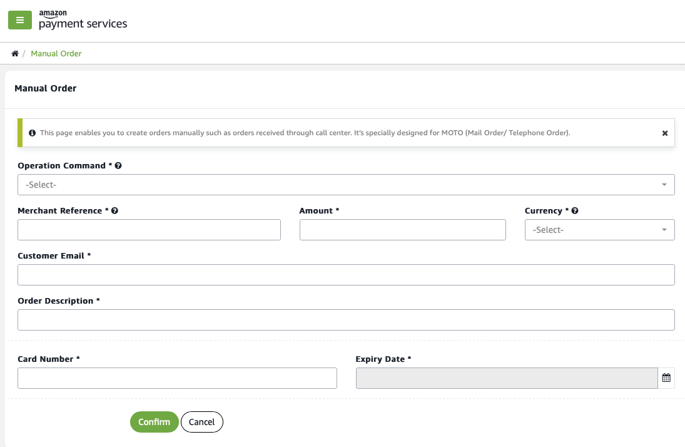

Processing offline payments (MOTO)
==================================

Amazon Payment's Services' MOTO channel enables you to process a range
of transactions that do not follow the standard online shopping
workflow.

For example, your customer may want to pay you offline. By sending an
order in the post, by calling you, or indeed in a face to face
transaction. You can process offline transactions using the MOTO
channel.

Or, where you have already successfully processed a transaction using a
customer's payment card, you can apply another charge to the customer's
payment card -- without asking your customer to confirm their payment
card details -- using the MOTO channel.

Through the MOTO channel you can easily accommodate customers that want
to make repeat transactions, or offline transactions through in-person
and telephone orders. The MOTO channel also lends itself to unique
merchant use cases.

What are MOTO transactions?
---------------------------

MOTO stands for mobile order, telephone order transactions. It is a
phrase used to describe processing transactions that occur outside of
the typical online shopping environment.

In other words, where your customer is not present at the time of the
transaction, or where you do not want to require your customer to
confirm their payment card details at the moment they make the
transaction.

### Offline transactions

Ordinarily, your customer will be on your website or mobile app when
making a purchase and will have the opportunity to enter their payment
card details to authorize a payment.

However, sometimes your customer may initiate a transaction over a
different channel -- by posting an order, or by making a phone call.

With offline transactions you need to manually process the payment --
either by entering the payment card details that your customer supplied,
or by charging payment card details you already hold. These transactions
are performed across the MOTO channel.

### Repeat transactions

You can also use the MOTO channel to process payments for a repeat
transaction. When you use the MOTO channel you do not need to request
that your customer re-confirms their payment card details when your
customer performs a repeat transaction.

Under some circumstances your customer will find it frustrating to
constantly confirm payment card details. For example, where repeated
low-value transactions are typical of your transaction workflow -- such
as food delivery, or taxi rides.

By using the MOTO channel, you can apply a charge to payment card
details you already hold without requiring your customer to confirm
their card details.

Note that choosing to use the MOTO channel can imply that transactions
are more vulnerable to a successful chargeback. Chargebacks are more
likely because at the time of charging your customer's card you did not
verify your customer's card details. However, chargebacks may not be a
big concern where transactions are low in value.

How do MOTO transactions work?
------------------------------

The MOTO channel facilitates any transactions that you are required to
process manually, or where you want to process a payment using payment
card details you already hold on file -- without asking your customer to
re-confirm their payment card details.

There are two routes to processing a MOTO transaction. First, you can
log in to the Amazon Payment Services back office and access the manual
order page. Or, you can use the MOTO channel in our API to execute a
transaction by making an API call from your server.

### Manual orders in the back office

You can use the manual order page in the Amazon Payment Services back
office to process a transaction that occurred offline. The process will
look similar to the following:

1.  You securely collect your customer's payment card details -- over a
    telephone call, for example.

2.  You log in to the Amazon Payment Services back office and you enter
    your customer's payment card details on the **Manual Order** page
    and submit the data.

3.  Amazon Payment Services will authenticate the payment details and
    return a confirmation.

4.  Once you receive confirmation you can mark your customer's payment
    as received.

Figure Manually charging a payment card using the Manual Order page

The MOTO API
------------

Amazon Payment Services provides an API that you can use to process MOTO
transactions. To process a transaction you must include a MOTO action in
a workflow that you custom-code into your website application.

By custom-coding a MOTO API interaction you can process orders taken on
an offline channel, or process repeat orders where you have already
charged your customer's payment card.

For repeat transactions the workflow will look as follows:

1.  You have already processed a successful transaction with your
    customer's payment card and your customer has supplied payment card
    details and passed security requirements. As a result, you obtained
    a token for your customer's payment card.

2.  Your customer returns for a repeated transaction and checks out
    online, or offline.

3.  You send a server request to Amazon Payment Services using the MOTO
    API to initiate a repeat charge, including the token obtained in the
    first step.

4.  Amazon Payment Services attempts to authorize a charge to your
    customer's card.

5.  Your server receives a response from Amazon Payment Services
    confirming the outcome of the authorization request.

When using the MOTO API for a repeat transaction you will refer to a
token that you have obtained when your customer successfully completed a
transaction at a previous point in time. Amazon Payment Services will
retrieve your customer's payment card details associated with that token
and apply a charge to your customer's card without interaction from your
customer.

Go to the full API reference
----------------------------

We've given you an overview of why you would want to use a MOTO
transaction and of how MOTO transactions work. Developers should [review
the full API
reference](https://paymentservices-reference.payfort.com//docs/api/build/index.html#moto-channel){target=_self}
for complete instructions.

Need further help?
------------------

Want to know more about where and why MOTO transactions fit into your
transaction workflow? Get in touch with the Amazon Payment Services
team. Just message our support team at <merchantsupport-ps@amazon.com>.
