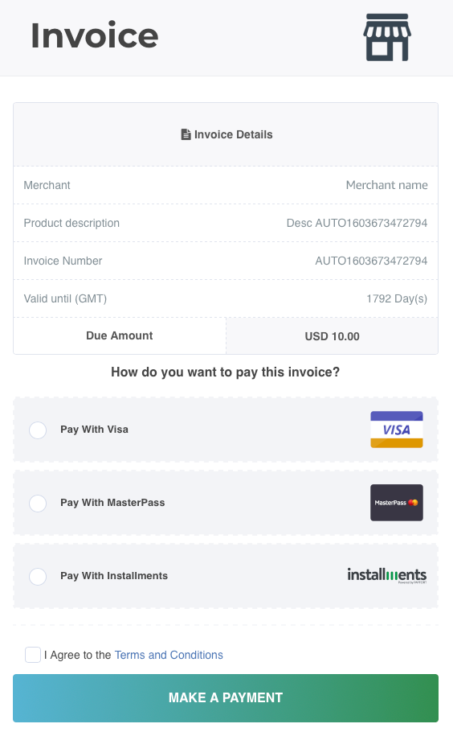
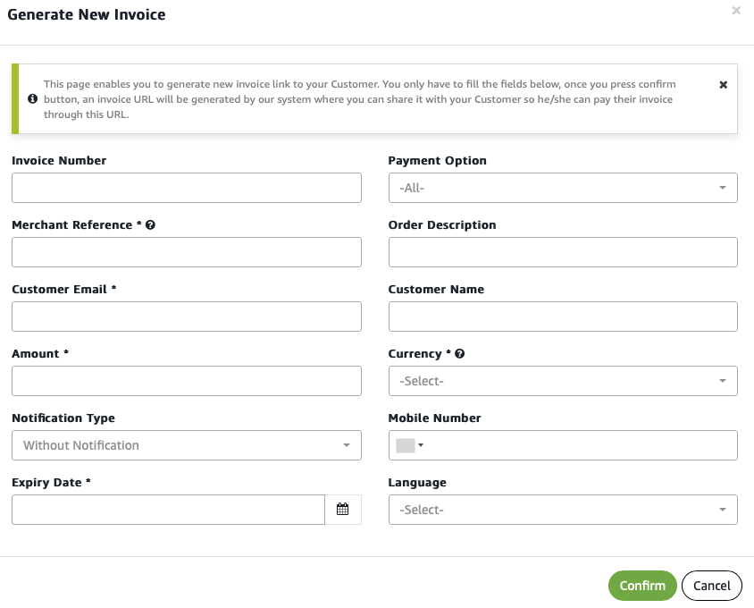
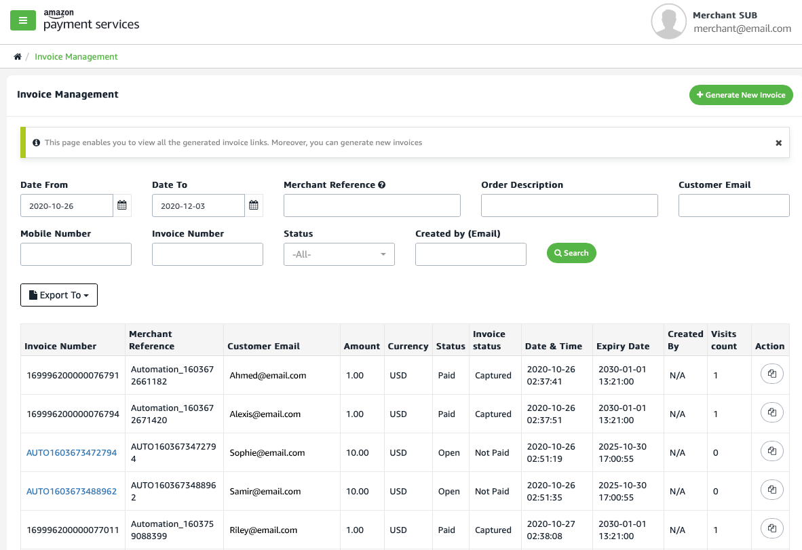

Generating and sending invoices
===============================

You can send your customers an invoice that includes a convenient
payment link using the invoice generating capabilities of Amazon Payment
Services. We call this service **Payment Link**.

Payment Link shortens the delay between issuing invoices and receiving
payment because invoices sent via Payment Link includes a direct payment link
that makes it easy for your customers to pay.

Whether you need to send a single invoice, or many invoices, the Amazon
Payment Services back office makes it easy to automate the process of
invoicing -- and collecting payment.

How does Payment Link work?
----------------------

Sending invoices via the Amazon Payment Services Payment Link services allows
you to combine billing and payment into one single message. With
Payment Link, you use a single step to generate an email with a customized
message that contains the amount owed, and a payment link.

When your customer clicks on the payment link they can conveniently pay
for the invoiced amount using the currency and payment method that they
prefer.

The payment link included in the invoice is directly connected to your
merchant account so that your customer's payment is simply and
efficiently processed by Amazon Payment Services.

You can choose to send a single invoice using the Amazon Payment
Services back office, but you can also use the back office to send
multiple invoices using a batch process. Or, use our API to connect to
our **Payment Link** service and automatically generate invoices from your
server.

What does the customer see?
---------------------------

When you send an invoice to your customer using the Payment Link service your
customer receives an email message or SMS that contains your customized
message, typically including an invoice amount, alongside a clear
payment link.

You can choose how you send the invoice. First, you can configure the
process so that Amazon Payment Services automatically sends a payment
link directly to your customer. Alternatively, you can use your email
server or SMS provider to send a customized message that contains the
payment link.

When your customer clicks on the payment link they are directed to an
Amazon Payment Service webpage where they can complete their payment.

Figure 1 - Sample of invoice sent to your customer

Once your customer's payment details are verified Amazon Payment
Services sends a confirmation to your customer including a transaction
reference number. We also send a confirmation to you stating that the
invoice that you sent has been paid.

You can view a summary of the invoices that are paid and that are
outstanding via the Amazon Payment Services back office. Finally, where
relevant, your developers can custom code a push notification service
that informs your application server whenever a payment link has
successfully triggered a payment.

Sending a single invoice
------------------------

If you need to only occasionally send invoices to your customers or have
a low volume of invoices to send you could opt to simply send invoices
one by one by accessing the **Generate New Invoice** area under
**Invoicing** in your Amazon Payment Services back office.

Figure 2 - Generating a one-off new invoice in the back office

On this page you specify key details including the invoice currency,
amount, as well as an order description and a merchant reference number.
When you confirm the details Amazon Payment Services will send to your
customer an email containing the invoice and a payment link.

Once your customer has paid, the successful payment will be visible in
the invoices section of the Amazon Payment Services back office.

Alternatively, you can create custom code on your server which uses our
API to generate and send invoices. Refer to our API reference.

Automatically sending invoices
------------------------------

To bulk generate invoices and collect payment using our Payment Link service
you simply need to upload a batch file for automated invoice generation.
You have two options when automatically sending invoices:

1.  Upload a batch file to the Amazon Payment Services back office and
    trigger the invoicing process from the back office.

2.  Alternatively, you can upload a file containing the invoice data by
    writing code that uses our batch invoice API. Our API will generate
    and send the invoices for you.

You can download the batch invoice template file from the Amazon Payment
Services back office -- it is located under the Batch Invoicing tab.

Once you have uploaded the invoicing batch file the Amazon Payment
Services server will send a response confirming receipt. This receipt is
sent to the administrator registered with Amazon Payment Services.

As a next step, you can choose to request a response that details the
outcomes of the invoices you generated, including full details of
payment outcomes. You do so by sending a request to the Amazon Payment
Services batch invoicing API.

Managing invoices
-----------------

Our Payment Link service makes it easy to keep track of the invoices you
sent, and which invoices have been paid thanks to the comprehensive back
office invoicing reporting tool.

Figure 3 - Use the back office to download reports of the invoices you
sent and the payment status

In the back office you can search for individual invoices or create a
custom report by specifying a date range -- you also have the ability to
export invoice data in CSV format to analyze using the tool of your
choice.

Go to the full API reference
----------------------------

If you choose to send invoices by using our batch invoicing API we
suggest that you read our API reference for complete details on how to
send invoices one by one, on demand -- and in bulk. [View the API
reference
here](https://paymentservices-reference.payfort.com//docs/api/build/index.html#batch-invoicing){target=_self}.

Get in touch
------------

Generating invoices via Amazon Payment Services can greatly speed up how
quickly you collect payments on outstanding invoices. Feel free to get
in touch to better understand how Payment Link can help your business. Reach
out to our team at <merchantsupport-ps@amazon.com>.
