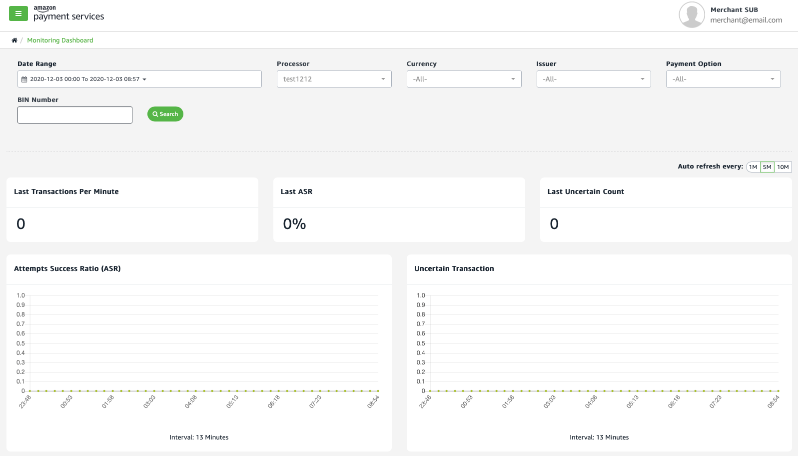

Monitoring and reporting tools
==============================

Amazon Payment Services offers a comprehensive range of back office
tools that enable you to manage and monitor critical aspects of your
merchant account. Tools available to you include real time transaction
analysis, web-based and API-driven reporting, and customizable
notifications.

Real time monitoring
--------------------

You can monitor your merchant account for key performance indicators and
for any unusual activity through our real time monitoring dashboard.

The monitoring dashboard in our back office allows you to monitor, in
real time, transaction performance aspects including the percentage of
transactions approved and the volume of refunds issued. The real time
monitoring dashboard updates continuously.

[Read more about real-time monitoring](61a.md).

Figure 1 Real time monitoring dashboard

Transaction dashboard
---------------------

Easily get an overview of the overall performance of your merchant
account with our transaction dashboard. View key indicators including
acceptance ratio, refund ratio, and the number of successful and failed
transactions.

[Read more about the transaction dashboard here](61b.md).

Reporting tools
---------------

Whether you require a simple point and click report or need direct
access to your transaction data you can rely on Amazon Payment Services'
reporting capabilities to give you the insights you need. We offer you
two routes to gain reporting insights:

-   **Back office reporting tool**. Enjoy easy access to your financial
    and transaction records through the **Reports** section in the back
    office -- including customizable reports. [Read more about
    generating reports here](62.md).

-   **Reporting API**. Custom-code a reporting workflow using our
    reporting API to extract and mine key transaction data. [Read more
    about our reporting API here](63.md).

Notifications
-------------

Timely notifications alert you to key trends in your merchant account
and to flag any transactions that can require an immediate response.

Avoid alert fatigue by customizing the notifications that you receive to
only send you the alerts that matter the most.

[Read more about managing your notifications here](64.md).

Get in touch
------------

Do you have any questions about monitoring, reporting, or notifications?
Simply get in touch with the team at <merchantsupport-ps@amazon.com>.
