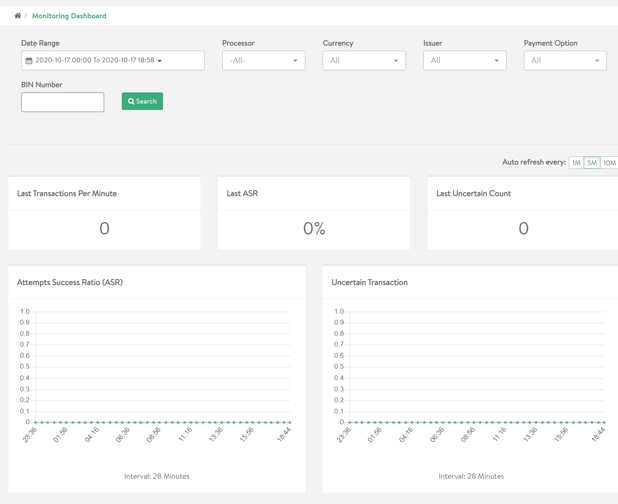
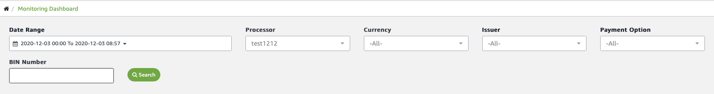

Real-time monitoring
====================

You can monitor the current status of transaction processing in your
merchant account in real time using our monitoring dashboard which
refreshes automatically. You can also configure push notifications and
transaction alerts.

The monitoring dashboard displays at-a-glance information on
transactions per minute, success ratios, and uncertain transactions. You
also get instant insight into failed responses and total payment volume.

Monitoring dashboard
--------------------

Amazon Payment Services provides you with a dashboard in your back
office that makes it easy to monitor transaction flows in real time.
It's easy to access the monitoring dashboard, simply click **Monitoring
Dashboard** in the top left in the back office navigation bar.

You can choose to specify a filter to limit real time monitoring to a
specific subsection of the transactions flowing through your merchant
account, or you can simply click **Search** to see a report reflecting
all transactions.

The monitoring dashboard will refresh automatically, delivering a
continuous update of your transaction performance right through the day.

What can I monitor in real time?
--------------------------------

The monitoring dashboard covers a range of key performance indicators.
At a glance, you can evaluate the number of transactions processed in
the last minute, the attempt success ratio (ASR) of your merchant
account -- and a total count of the uncertain transactions currently in
your transaction pipeline.

Our monitoring dashboard displays a graph that enables you to monitor
the attempt success ratio in real time, with a second graph displaying
the number of uncertain transactions over a period of time.

Other data points that you can monitor include failed response codes, as
well as the uncertain transactions by issuer and by processor. We also
display a total payment volume for your merchant account.

Customizing real time monitoring
--------------------------------

You can adjust the way real time monitoring data is displayed in two
ways. First, you can choose to filter the data displayed in the
monitoring dashboard against a range of criteria -- including dates,
processor, currency, issuer, and the payment option. You can also filter
against the BIN number.

You can also configure how frequently the real time data is refreshed --
selecting amongst one minute, five minute and ten minute intervals.

Notifications
-------------

You don't need to log in to the monitoring dashboard to monitor your
transactions. Instead, customize the notifications you receive so that
you are alerted when KPIs drop below expected levels -- or when specific
transaction events occur, such as a failed purchase.

[Read more about notifications here](64.md).

Get in touch
------------

Do you have any questions about real time monitoring or need to know how
to answer a specific reporting query? Feel free to get in touch with our
team at <merchantsupport-ps@amazon.com>.
