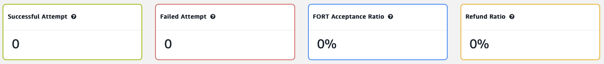
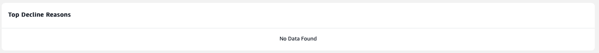

Transaction dashboard
=====================

It's easy to keep a close eye on your day to day transaction performance
so that you can rapidly respond to changing business circumstances.

The Amazon Payment Services dashboard helps you to monitor the
performance of your merchant account, including an instant overview of
transaction volume, acceptance rates and the most common reasons for a
decline.

What can I review on the transaction dashboard?
-----------------------------------------------

Using the transaction dashboard you get an instant overview of your
transaction performance at a single glance.

Key insights include acceptance ratios, the refund ratio, and common
reasons for declines. The transaction dashboard helps you to monitor
for, and to debug, any issues in your transaction performance.

The monitoring panel automatically draws a line graph for both
successful and declined transactions so you can quickly differentiate
between these two critical categories.

At the top of the dashboard you'll find KPI's for critical merchant
account data, including:

-   **Successful transactions**. An indicator that counts how many
    successful transactions were processed through your merchant
    account. We include successful capture transactions and purchase
    transactions in this figure -- amounts that were merely authorized
    do not count.

-   **Failed transactions**. Here we render a figure representing failed
    transactions which we calculate by adding up failed authorizations,
    failed purchases, and any transactions that are incomplete or where
    the transaction was dropped for another reason.

-   **Acceptance ratio**. An easy to reference figure that highlights
    the ratio of successful compared to failed transactions.

-   **Refund ratio**. Quickly see what percentage of your transactions
    are leading to refund requests, as calculated by dividing the total
    number of refunded transactions by the total number of approved
    transactions.

Figure KPI Dashboard

We also provide two detailed and customizable graphs outlining
acceptance by number of transactions and acceptance by volume so that
you can monitor acceptance performance over a period of time.

Finally, the transaction dashboard provides you with a list of the most
common reasons why transactions are getting declined in your merchant
account.

The list denoting top decline reasons a critical tool that can help you
identify emerging problems before these start to affect a wider group of
customers.

Figure View the most common reasons transactions are declined

Customizing the transaction dashboard
-------------------------------------

You can adjust the transaction data is displayed in two ways. First, you
can choose to monitor according to a specific currency -- by USD, or
AED, for example.

Next, you can adjust the transaction period to only cover a specific
date range -- while also selecting amongst daily, weekly and monthly
monitoring.

In other words, you can easily get an overview of your performance on a
specific day, while also retrieving a quick visual overview that
outlines performance over the period of a year.

Generating reports
------------------

Note that you can get more specific answers to your monitoring questions
by making use of our reporting tool.

You enjoy access to both financial reporting covering successful
transactions, and broader reporting detailing the full transaction
history. We also offer access to our reporting tool via an API so that
you can build your own reporting application.

[Read more about reporting here](62.md).

Get in touch
------------

Do you have any questions about the transaction dashboard, or need to
know how to answer a specific reporting query? Feel free to get in touch
with our team at <merchantsupport-ps@amazon.com>.
