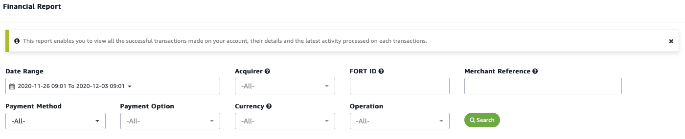
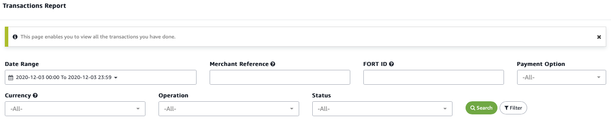

Generating reports
==================

Use the back office reporting tool to monitor the performance of your
merchant account while also drawing insights across specific aspects of
your transaction pipeline -- from payment method, right down to
individual acquirer.

You don't need coding skills to generate customized, detailed reports in
our back office. Just point and click and extract the report you'd like
to see.

Which reports can I generate?
-----------------------------

We offer two reporting tools -- one focused on drawing financial
reporting data, another for broader transaction data.

### Financial reports

You can supply your finance team with the critical data they need by
extracting a customized report using our **Financial Reports** tool,
accessible under the **Reports** tab.

Figure 1 Requesting a financial data report

There are several reporting aspects you can customize to extract the
data that you require. For example, you can search by your merchant
reference ID. Or, you can search by using the unique transaction unique
ID to find a specific order. You can also narrow down searches by date
range. Other aspects you can search by include:

-   **Acquirer**. Search by the bank or financial institution that
    processed your customer's payment card.

-   **Payment method**. Filter transactions according to the underlying
    payment method -- whether debit card, credit card, or consumer
    finance.

-   **Payment option**. You can also filter your financial report
    according to the underlying payment network -- by restricting
    results to Visa or Mastercard, for example.

-   **Currency**. Choose from processing currencies to filter your
    financial report according to the underlying currency.

-   **Operational data**. If you need to generate a report that lists
    all refunded transactions then you can easily do so by filtering for
    Refund operations. Or, filter for any of authorization, void
    authorization, capture, or purchase.

Our financial reporting tool, therefore, gives you the ability to
extract key financial data that reflects the events in your merchant
account.

Transaction reports
-------------------

While every financial data point will be reflected by a transaction, not
every transaction will generate a financial data point. That is why we
provide a distinct transaction reporting tool.

You can get full insight into all your transactions using the
transaction reporting tool. Transaction reporting works in a similar way
to generating financial reports -- simply access **Transaction Reports**
under the **Reports** tab.

Figure Requesting a transaction data report

You can filter across a similar set of fields as you can with the
financial reporting tool, but transaction reporting also allows you to
filter according to a detailed list of transaction conditions.

In the **Status** field you can select to filter for a range of
transaction status conditions, including accepted, declined, pending,
uncertain, dropped, in review, on hold, and processing.

This gives you the ability to retrieve a finely grained report that
shows you transactions that are in a certain state -- across a set of
requirements that you specify.

API-driven reporting
--------------------

Note that you can extract highly customized reports by using our
reporting API. By custom-coding reporting capabilities that directly
link to your web application, you can analyze your Amazon Payment
Services transaction data in great depth.

[Read more about our reporting API here](63.md).

Get in touch
------------

If you get stuck feel free to get in touch with the Amazon Payment
Services team. Just message our support team at <merchantsupport-ps@amazon.com>.
