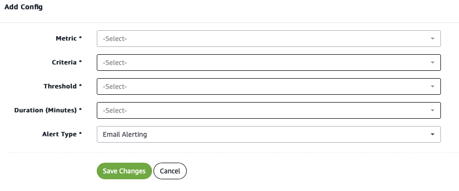

Notification management
=======================

Stay on top of your merchant account with instant notifications sent
directly to your inbox. With Amazon Payment Services you can customize
your notification stream to achieve the right level of detail, ensuring
that you're kept abreast of critical changes in the performance of your
merchant account.

What notifications can I receive?
---------------------------------

You can configure your notifications to deliver as much or as little
notification messages as you require. We also allow you to customize the
notifications that your customers receive when you process a
transaction.

Finally, you can set up custom notifications that alert you when your
transaction processing metrics exceed specific thresholds.

Note that the notifications discussed on this page are intended to alert
you to broader developments in your merchant account. Notifications are
not intended to flag issues with individual transactions. For more about
handling transaction responses [read our page on response handling
here](38.md).

Merchant notifications
----------------------

You can set an alert for a range of activities on your account --
including successful transactions and failed transactions. Notifications
can be sent to a single email address or you can choose to send
notifications to several key personnel.

To customize merchant notifications simply go to the **Account Setup**
screen and select **Notification Management**.

=

Figure Setting up transactions notifications to your email address

Custom notifications
--------------------

While your web and mobile application may already issue notifications to
your customers confirming the status of transactions, you do have the
option to request that Amazon Payment Services also directly send
transaction alerts to your customers.

You can send your customer a notification when any of the following
events occur:

-   Purchase Success

-   Authorization Success

-   Capture Success

-   Refund Success

-   Void Authorization Success

-   Purchase Failure

-   Authorization Failure

-   Capture Failure

-   Refund Failure

-   Void Authorization Failure

-   Invoice

Access the notifications settings for your customers under **Account
Setup** and **Notification Management**.

Custom monitoring alerts
------------------------

You can configure a custom monitoring alert that lasts for a specific
period of time. Customize your alerts and make sure that you are
instantly informed when the KPIs that matter to your business fall
outside expected limits.

Doing so enables you to monitor for specific problems according to set
criteria and thresholds -- useful for debugging tricky issues, or to
alert you to a developing situation.

For example, you can set an alert that notifies you when the attempts
success ratio (ASR) drops below a specific percentage.

To set up a customer alert navigate to your profile image on the top
right of the back office screen, select **Monitoring Alert Config,** and
click **Add Config.** Amazon Payment Services support alerts across
email, SMS, and voice.

Figure Configure a custom monitoring alert

Get in touch
------------

Getting stuck with notifications? Any questions? Get in touch with the
Amazon Payment Services team. Just message our support team at
<merchantsupport-ps@amazon.com>.
