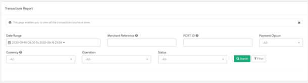

Transaction queries
===================

Merchants frequently need to examine the details and outcome of a
specific transaction. Your customer may have a specific query, for
example. Or, you may need to resolve a technical glitch.

You can query a specific transaction via the back office and retrieve
full details outlining the transaction status. You can also send the
check status command to our API for a status report on a specific
transaction, or use our API to extract bulk transaction data.

Transaction queries using the back office
-----------------------------------------

It's easy to find out what the status is of any given transaction. You
can quickly search for a specific transaction by visiting the
**Transaction Report** page, located under the **Reports** tab.

In doing so you can search for a transaction by looking up your unique
merchant ID, or by using the unique transaction reference number
provided by Amazon Payment Services.

The search results will show you exactly what happened to a specific
transaction -- confirming approval or decline, for example.

Figure Querying a specific transaction

Using the API for transaction queries
-------------------------------------

Amazon Payment Service offers an API that allows you to custom code a
server application that extracts critical transaction data.

You can use our API to query specific transactions. First, you can check
the status for a specific transaction by using the check status API
command. [Read more about check status here](39.md).

We also offer a reporting API provides the flexibility to extract large
amounts of data by sending a single request for a bulk response.

[Read more about our reporting API here.](63.md)

Need further help?
------------------

The ability to analyze what happened with a specific transaction is
important. If you get stuck feel free to get in touch with the Amazon
Payment Services team. Just message our support team at
<merchantsupport-ps@amazon.com>.
